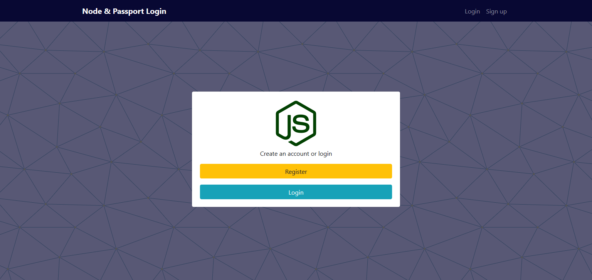

# **Simple User Registration and Login functionality with MongoDB, ExpressJs, and NodeJs with passport authentication**


Node & Express login app with passportjs authentication

This project uses the following technologies:

- [EJS](https://ejs.co) templates for frontend
- [Express](http://expressjs.com/) and [Node](https://nodejs.org/en/) for the backend
- [MongoDB](https://www.mongodb.com/) for the database
- [passportjs](https://passportjs.org) for authentication


## Configuration

Make sure to add your own `mangoURI` from your [MangoDB](http://mangodb.com) database and put in  `config/keys.js`.

```
{
    "mongoURI": "YOUR_MONGO_URI_HERE",
}
```

## Quick Start

```javascript
// Install dependencies 
npm install

// Run server with nodemon
npm run dev

// Server runs on http://localhost:5000
```
